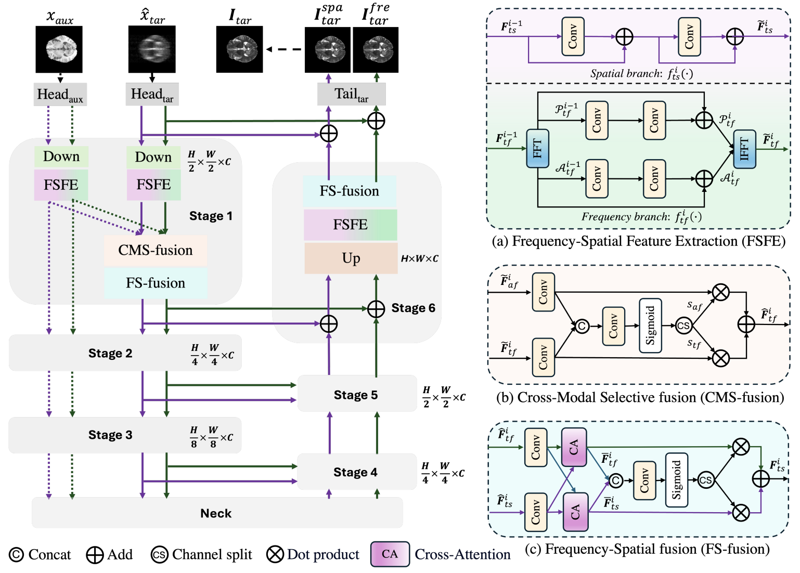

# FSMNet
FSMNet efficiently explores global dependencies across different modalities. Specifically, the features for each modality are extracted by the Frequency-Spatial Feature Extraction (FSFE) module, featuring a frequency branch and a spatial branch. Benefiting from the global property of the Fourier transform, the frequency branch can efficiently capture global dependency with an image-size receptive field, while the spatial branch can extract local features. To exploit complementary information from the auxiliary modality, we propose a Cross-Modal Selective fusion (CMS-fusion) module that selectively incorporate the frequency and spatial features from the auxiliary modality to enhance the corresponding branch of the target modality. To further integrate the enhanced global features from the frequency branch and the enhanced local features from the spatial branch, we develop a Frequency-Spatial fusion (FS-fusion) module, resulting in a comprehensive feature representation for the target modality. 

<p align="center"></p>

## Paper

<b>Accelerated Multi-Contrast MRI Reconstruction via Frequency and Spatial Mutual Learning</b> <br/>
[Qi Chen](https://scholar.google.com/citations?user=4Q5gs2MAAAAJ&hl=en)<sup>1</sup>, [Xiaohan Xing](https://hathawayxxh.github.io/)<sup>2, *</sup>, [Zhen Chen](https://franciszchen.github.io/)<sup>3</sup>, [Zhiwei Xiong](http://staff.ustc.edu.cn/~zwxiong/)<sup>1</sup> <br/>
<sup>1 </sup>University of Science and Technology of China,  <br/>
<sup>2 </sup>Stanford University,  <br/>
<sup>3 </sup>Centre for Artificial Intelligence and Robotics (CAIR), HKISI-CAS  <br/>
MICCAI, 2024 <br/>
[paper](http://arxiv.org/abs/2409.14113) | [code](https://github.com/qic999/FSMNet) | [huggingface](https://huggingface.co/datasets/qicq1c/MRI_Reconstruction)

## 0. Installation

```bash
git clone https://github.com/qic999/FSMNet.git
cd FSMNet
```

See [installation instructions](documents/INSTALL.md) to create an environment and obtain requirements.

## 1. Prepare datasets
Download BraTS dataset and fastMRI dataset and save them to the `datapath` directory.
```
cd $datapath
# download brats dataset
wget https://huggingface.co/datasets/qicq1c/MRI_Reconstruction/resolve/main/BRATS_100patients.zip
unzip BRATS_100patients.zip
# download fastmri dataset
wget https://huggingface.co/datasets/qicq1c/MRI_Reconstruction/resolve/main/singlecoil_train_selected.zip
unzip singlecoil_train_selected.zip
```

## 2. Training
##### BraTS dataset, AF=4
```
python train_brats.py --root_path /data/qic99/MRI_recon image_100patients_4X/ \
    --gpu 0 --model_name unet_single --batch_size 4 --base_lr 0.0001 --MRIDOWN 4X --low_field_SNR 0 \
    --input_normalize mean_std \
    --exp FSMNet_BraTS_4x
```

##### BraTS dataset, AF=8
```
python train_brats.py --root_path /data/qic99/MRI_recon/image_100patients_8X/ \
    --gpu 1 --model_name unet_single --batch_size 4 --base_lr 0.0001 --MRIDOWN 8X --low_field_SNR 0 \
    --input_normalize mean_std \
    --exp FSMNet_BraTS_8x
```

##### fastMRI dataset, AF=4
```
python train_fastmri.py --root_path /data/qic99/MRI_recon/fastMRI/ \
    --gpu 0 --model_name unet_single --batch_size 4 --base_lr 0.0001 --CENTER_FRACTIONS 0.08 --ACCELERATIONS 4 \
    --exp FSMNet_fastmri_4x
```

##### fastMRI dataset, AF=8
```
python train_fastmri.py --root_path /data/qic99/MRI_recon/fastMRI/ \
    --gpu 1 --model_name unet_single --batch_size 4 --base_lr 0.0001 --CENTER_FRACTIONS 0.04 --ACCELERATIONS 8 \
    --exp FSMNet_fastmri_8x
```

## 3. Testing
##### BraTS dataset, AF=4
```
python test_brats.py --root_path /data/qic99/MRI_recon/image_100patients_4X/ \
    --gpu 3 --model_name unet_single --base_lr 0.0001 --MRIDOWN 4X --low_field_SNR 0 \
    --input_normalize mean_std \
    --exp FSMNet_BraTS_4x --phase test
```

##### BraTS dataset, AF=8
```
python test_brats.py --root_path /data/qic99/MRI_recon/image_100patients_8X/ \
    --gpu 4 --model_name unet_single --base_lr 0.0001 --MRIDOWN 8X --low_field_SNR 0 \
    --input_normalize mean_std \
    --exp FSMNet_BraTS_8x --phase test
```

##### fastMRI dataset, AF=4
```
python test_fastmri.py --root_path /data/qic99/MRI_recon/fastMRI/ \
    --gpu 5 --model_name unet_single --batch_size 4 --base_lr 0.0001 --CENTER_FRACTIONS 0.08 --ACCELERATIONS 4 \
    --exp FSMNet_fastmri_4x --phase test
```

##### fastMRI dataset, AF=8
```
python test_fastmri.py --root_path /data/qic99/MRI_recon/fastMRI/ \
    --gpu 6 --model_name unet_single --batch_size 4 --base_lr 0.0001 --CENTER_FRACTIONS 0.04 --ACCELERATIONS 8 \
    --exp FSMNet_fastmri_8x --phase test
```